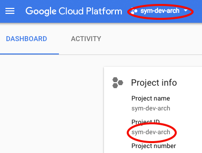
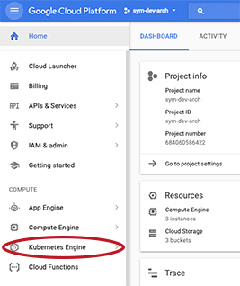
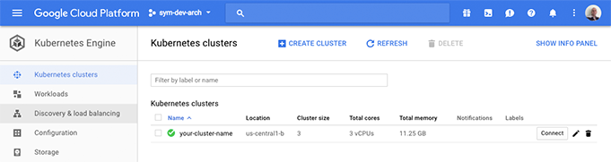
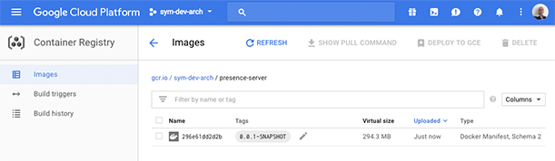

# canon-example
An example service based on japigen code generation

In order to follow these instructions all the way through you will need access to a Google Cloud project, which your tech lead should be able to give you. If you do not have access to Google Cloud and wish to follow the local parts of these instructions then use the default name **sym-dev-arch** where a project name is required.

Point your web browser to the [Google Cloud Platform Console](https://console.cloud.google.com), look near the top left corner of the page for the project selector, the project name shown in this screen shot is **sym-dev-arch**.



If the correct project is not listed then talk to your project lead to have yourself added to the project.

If the name of the project is globally unique (as it is in the screen shot) then the project ID will be the same as the project name, if not then the project ID will have additional digits added to the name to make it unique. The Project ID is shown in the dashboard section of the GCP Console as shown in the screen shot above. Make a note of the Project ID.

In order to build the sample application you will need a local Docker container. If you do not have a Docker container installed then you can download the Community Edition from [The Docker Store](https://www.docker.com/community-edition).

## Clone the Repo and Set Environment Variables
Clone this repo into a convenient location:

```
$ mkdir /tmp/git
$ cd /tmp/git
$ git clone https://github.com/SymphonyOSF/canon-example.git
Cloning into 'canon-example'...
remote: Counting objects: 118, done.
remote: Compressing objects: 100% (57/57), done.
remote: Total 118 (delta 45), reused 91 (delta 22), pack-reused 0
Receiving objects: 100% (118/118), 33.69 KiB | 11.23 MiB/s, done.
Resolving deltas: 100% (45/45), done.
$ cd canon-example/
$ ls
LICENSE     README.md   S2-presence-client  S2-presence-server  pom.xml
$ 
```

Set the ID of the project you will be using as the variable **$PROJECT** with the following commands **N.B. replace the name "sym-dev-arch" with the ID of the project you will be using**

```
$ export PROJECT=sym-dev-arch
$ echo $PROJECT
sym-dev-arch
$ 
```

Edit the project pom (the file pom.xml in the current directory), search for the definition of the
property **gcp.project** and replace the name **sym-dev-arch** with the name of your Google Cloud project.

``` 
    <gcp.project>sym-dev-arch</gcp.project>
  </properties>
```

Set the variable **$VERSION** to the current version for this project, you can do this with the following command:

```
$ export VERSION=`mvn help:evaluate -Dexpression=project.version | grep -v "^[[]"`
$ echo $VERSION
0.0.1-SNAPSHOT
$ 
```

## Build and Run the PresenceServer locally
Build the application by executing the command:

```
$ mvn clean package
[INFO] Scanning for projects...
[INFO] ------------------------------------------------------------------------
[INFO] Reactor Build Order:
[INFO] 
[INFO] JAPIgen Example Application
[INFO] S2-presence-client
[INFO] S2-presence-server
[INFO] 
[INFO] ------------------------------------------------------------------------
[INFO] Building JAPIgen Example Application 0.0.1-SNAPSHOT
[INFO] ------------------------------------------------------------------------
```
_Many lines of output omitted_

```
[INFO] --- maven-jar-plugin:3.0.1:jar (default-jar) @ S2-presence-server ---
[INFO] Building jar: /Users/bruce/symphony/git-SymphonyOSF/canon-example/S2-presence-server/target/S2-presence-server-0.0.1-SNAPSHOT.jar
[INFO] 
[INFO] --- docker-maven-plugin:0.23.0:build (docker:build) @ S2-presence-server ---
[INFO] Copying files to /Users/bruce/symphony/git-SymphonyOSF/canon-example/S2-presence-server/target/docker/presence-server/0.0.1-SNAPSHOT/build/maven
[INFO] Building tar: /Users/bruce/symphony/git-SymphonyOSF/canon-example/S2-presence-server/target/docker/presence-server/0.0.1-SNAPSHOT/tmp/docker-build.tar
[INFO] DOCKER> [presence-server:0.0.1-SNAPSHOT] "presence-server": Created docker-build.tar in 557 milliseconds
[INFO] DOCKER> [presence-server:0.0.1-SNAPSHOT] "presence-server": Built image sha256:00261
[INFO] DOCKER> [presence-server:0.0.1-SNAPSHOT] "presence-server": Removed old image sha256:3a02b
[INFO] ------------------------------------------------------------------------
[INFO] Reactor Summary:
[INFO] 
[INFO] JAPIgen Example Application ........................ SUCCESS [  0.581 s]
[INFO] S2-presence-client ................................. SUCCESS [  3.568 s]
[INFO] S2-presence-server ................................. SUCCESS [  2.808 s]
[INFO] ------------------------------------------------------------------------
[INFO] BUILD SUCCESS
[INFO] ------------------------------------------------------------------------
[INFO] Total time: 7.139 s
[INFO] Finished at: 2018-01-23T13:48:50-08:00
[INFO] Final Memory: 36M/754M
[INFO] ------------------------------------------------------------------------
$ 
```

The build generates a docker image for the server process including all the dependencies. We can execute the process directly with the following command:

```
$ java -cp "S2-presence-server/target/docker/gcr.io/$PROJECT/presence-server/$VERSION/build/maven/*" com.symphony.s2.presence.PresenceServer

```

This starts a server which listens for HTTP requests on port 8080, you will see a large number of log messages on stdout. You can test the server from another terminal window with the following command:

```
$ curl http://127.0.0.1:8080/presence/v2/users
{"_type":"https://github.com/bruceskingle/canon/blob/master/canon-test/src/main/resources/test/presence.json#/components/schemas/UserPresencePage","data":[{"_type":"https://github.com/bruceskingle/canon/blob/master/canon-test/src/main/resources/test/presence.json#/components/schemas/UserPresence","status":"Available","text":"I'm Free!","userId":1},{"_type":"https://github.com/bruceskingle/canon/blob/master/canon-test/src/main/resources/test/presence.json#/components/schemas/UserPresence","status":"Available","text":"Talk to me!","userId":2},{"_type":"https://github.com/bruceskingle/canon/blob/master/canon-test/src/main/resources/test/presence.json#/components/schemas/UserPresence","status":"Busy","text":"","userId":3}]}
$ 
```

The GET /presence/v2/users method returns a list of the presence satus for all users in the system. The example implementation initializes its data set with three users, note that the data array in the response contains the status for users with userId 1, 2, and 3 and the response ends **"userId":3}]}**

Kill the locally running server by typing Ctrl-C in the window where you started it.

## Deploy to Your Local Docker Container
You can see what containers are running with the command

```
$ docker ps
CONTAINER ID        IMAGE                                                     COMMAND                  CREATED             STATUS              PORTS                    NAMES
$
```

You can start a local copy of the application with the command:

```
$ mvn docker:start
[INFO] Scanning for projects...
[INFO] ------------------------------------------------------------------------
[INFO] Reactor Build Order:
[INFO] 
[INFO] JAPIgen Example Application
[INFO] S2-presence-client
[INFO] S2-presence-server
[INFO] 
[INFO] ------------------------------------------------------------------------
[INFO] Building JAPIgen Example Application 0.0.1-SNAPSHOT
[INFO] ------------------------------------------------------------------------
[INFO] 
[INFO] --- docker-maven-plugin:0.23.0:start (default-cli) @ canon-example ---
[INFO] 
[INFO] ------------------------------------------------------------------------
[INFO] Building S2-presence-client 0.0.1-SNAPSHOT
[INFO] ------------------------------------------------------------------------
[INFO] 
[INFO] --- docker-maven-plugin:0.23.0:start (default-cli) @ S2-presence-client ---
[INFO] 
[INFO] ------------------------------------------------------------------------
[INFO] Building S2-presence-server 0.0.1-SNAPSHOT
[INFO] ------------------------------------------------------------------------
[INFO] 
[INFO] --- docker-maven-plugin:0.23.0:start (default-cli) @ S2-presence-server ---
[INFO] DOCKER> [gcr.io/sym-dev-arch/presence-server:0.0.1-SNAPSHOT] "presence-server": Start container c38211433373
[INFO] ------------------------------------------------------------------------
[INFO] Reactor Summary:
[INFO] 
[INFO] JAPIgen Example Application ........................ SUCCESS [  0.939 s]
[INFO] S2-presence-client ................................. SUCCESS [  0.021 s]
[INFO] S2-presence-server ................................. SUCCESS [  0.628 s]
[INFO] ------------------------------------------------------------------------
[INFO] BUILD SUCCESS
[INFO] ------------------------------------------------------------------------
[INFO] Total time: 2.125 s
[INFO] Finished at: 2018-01-23T15:39:54-08:00
[INFO] Final Memory: 25M/411M
[INFO] ------------------------------------------------------------------------
$ docker ps
CONTAINER ID        IMAGE                                                     COMMAND                  CREATED             STATUS              PORTS                    NAMES
c38211433373        gcr.io/sym-dev-arch/presence-server:0.0.1-SNAPSHOT   "/bin/sh -c 'java -c…"   1 second ago        Up 4 seconds        0.0.0.0:8080->8080/tcp   epic_snyder
$ 
```

As you can see from the **docker ps** output, port 8080 in the container is mapped to the same port on the host machine, so you can use the same command as before to check that the server is running:

```
$ curl http://127.0.0.1:8080/presence/v2/users
{"_type":"https://github.com/bruceskingle/canon/blob/master/canon-test/src/main/resources/test/presence.json#/components/schemas/UserPresencePage","data":[{"_type":"https://github.com/bruceskingle/canon/blob/master/canon-test/src/main/resources/test/presence.json#/components/schemas/UserPresence","status":"Available","text":"I'm Free!","userId":1},{"_type":"https://github.com/bruceskingle/canon/blob/master/canon-test/src/main/resources/test/presence.json#/components/schemas/UserPresence","status":"Available","text":"Talk to me!","userId":2},{"_type":"https://github.com/bruceskingle/canon/blob/master/canon-test/src/main/resources/test/presence.json#/components/schemas/UserPresence","status":"Busy","text":"","userId":3}]}
$ 
```

To stop the container you can use the command:

```
$ mvn docker:stop
[INFO] Scanning for projects...
[INFO] ------------------------------------------------------------------------
[INFO] Reactor Build Order:
[INFO] 
[INFO] JAPIgen Example Application
[INFO] S2-presence-client
[INFO] S2-presence-server
[INFO] 
[INFO] ------------------------------------------------------------------------
[INFO] Building JAPIgen Example Application 0.0.1-SNAPSHOT
[INFO] ------------------------------------------------------------------------
[INFO] 
[INFO] --- docker-maven-plugin:0.23.0:stop (default-cli) @ canon-example ---
[INFO] 
[INFO] ------------------------------------------------------------------------
[INFO] Building S2-presence-client 0.0.1-SNAPSHOT
[INFO] ------------------------------------------------------------------------
[INFO] 
[INFO] --- docker-maven-plugin:0.23.0:stop (default-cli) @ S2-presence-client ---
[INFO] 
[INFO] ------------------------------------------------------------------------
[INFO] Building S2-presence-server 0.0.1-SNAPSHOT
[INFO] ------------------------------------------------------------------------
[INFO] 
[INFO] --- docker-maven-plugin:0.23.0:stop (default-cli) @ S2-presence-server ---
[INFO] DOCKER> [gcr.io/sym-dev-arch/presence-server:0.0.1-SNAPSHOT] "presence-server": Stop and removed container c38211433373 after 0 ms
[INFO] ------------------------------------------------------------------------
[INFO] Reactor Summary:
[INFO] 
[INFO] JAPIgen Example Application ........................ SUCCESS [  0.936 s]
[INFO] S2-presence-client ................................. SUCCESS [  0.019 s]
[INFO] S2-presence-server ................................. SUCCESS [ 10.615 s]
[INFO] ------------------------------------------------------------------------
[INFO] BUILD SUCCESS
[INFO] ------------------------------------------------------------------------
[INFO] Total time: 12.088 s
[INFO] Finished at: 2018-01-23T15:45:16-08:00
[INFO] Final Memory: 25M/410M
[INFO] ------------------------------------------------------------------------
$ 

```

If you re-run docker ps you can confirm that the container was terminated:

```
$ docker ps
CONTAINER ID        IMAGE               COMMAND             CREATED             STATUS              PORTS               NAMES
$ 
```

## Setup Your Google Cloud Development Environment
You need to be given access to the Google Project for your service, and to install the Google SDK.


If you do not already have it installed, download the gcloud SDK from [https://cloud.google.com/sdk/downloads](https://cloud.google.com/sdk/downloads)

Next install **kubectl** (it is safe to execute this command if it is already installed) and set values for various configuration parameters:

```
$ gcloud components install kubectl

All components are up to date.
$ gcloud config set project $PROJECT
Updated property [core/project].
$ gcloud config set compute/region us-central1
Updated property [compute/region].
$ gcloud config set compute/zone us-central1-b
Updated property [compute/zone].
$ gcloud config list
[compute]
region = us-central1
zone = us-central1-b
[core]
account = your.name@your.domain
disable_usage_reporting = True
project = sym-dev-arch

Your active configuration is: [default]
$ 

```

## Setup A Google Cloud Kubernetes Cluster
This would normally be done once, by the tech lead, for any given service.

Choose a name for the cluster and set it as $CLUSTER and then create a cluster with the following commands:

```
$ export CLUSTER=your-cluster-name
$ echo $CLUSTER
your-cluster-name
$ gcloud container clusters create $CLUSTER
Creating cluster your-cluster-name.../
$ 
```

This process may take several minutes. Once it completes, verify that you have connectivity to the cluster as follows:

```
$ gcloud container clusters list
NAME               LOCATION       MASTER_VERSION  MASTER_IP        MACHINE_TYPE   NODE_VERSION  NUM_NODES  STATUS
your-cluster-name  us-central1-b  1.7.11-gke.1    130.211.131.169  n1-standard-1  1.7.11-gke.1  3          RUNNING
$ gcloud container clusters get-credentials $CLUSTER
Fetching cluster endpoint and auth data.
kubeconfig entry generated for your-cluster-name.
$ kubectl get services
NAME         TYPE        CLUSTER-IP    EXTERNAL-IP   PORT(S)   AGE
kubernetes   ClusterIP   10.31.240.1   <none>        443/TCP   14h
$ 
```

Also check that you can see the cluster in the Google Cloud Console, select **Kubernetes Engine** in the left nav:



and then you should see the cluster, like this:




You can see the generated docker image in your local docker registry by executing the command:

```
$ docker images
REPOSITORY                                                  TAG                 IMAGE ID            CREATED             SIZE
gcr.io/sym-dev-arch/presence-server                    0.0.1-SNAPSHOT      fddefc59a7f5        19 minutes ago      753MB
$
```

We now need to push this image to the Docker registry in your Google Project:

```
$ gcloud docker -- push gcr.io/$PROJECT/presence-server:$VERSION
The push refers to repository [gcr.io/sym-dev-arch/presence-server]
bb4a67556d99: Pushed 
875b1eafb4d0: Layer already exists 
7ce1a454660d: Layer already exists 
d3b195003fcc: Layer already exists 
92bd1433d7c5: Layer already exists 
f0ed7f14cbd1: Layer already exists 
b31411566900: Layer already exists 
06f4de5fefea: Layer already exists 
851f3e348c69: Layer already exists 
e27a10675c56: Layer already exists 
0.0.1-SNAPSHOT: digest: sha256:d91bfe8c5a1a8d83b62dc1d7e6182ef319fc82798268834f3a4aa12b65b3fcfa size: 2423
$ 

```

The image is visible in the **Container Registry** section of the GCP Console:



Now we can deploy the image:

```
$ kubectl run presence-server --image gcr.io/$PROJECT/presence-server:$VERSION --port 8080
deployment "presence-server" created
$
```

We can find the ID of the running instance (known as a pod in Kubernetes) like this:

```
$ kubectl get pods
NAME                              READY     STATUS    RESTARTS   AGE
presence-server-775063857-mbqw8   1/1       Running   0          39s
```

...and see the log output for a given pod like this:

```
$ kubectl logs presence-server-775063857-mbqw8
00:14:38.677 [main] DEBUG org.eclipse.jetty.util.log - Logging to Logger[org.eclipse.jetty.util.log] via org.eclipse.jetty.util.log.Slf4jLog
```
_Many lines of log output omitted_

```
00:14:39.292 [main] INFO  o.e.jetty.server.AbstractConnector - Started ServerConnector@694e1548{HTTP/1.1,[http/1.1]}{0.0.0.0:8080}
00:14:39.298 [main] DEBUG o.e.j.u.component.AbstractLifeCycle - STARTED @1264ms ServerConnector@694e1548{HTTP/1.1,[http/1.1]}{0.0.0.0:8080}
00:14:39.299 [main] INFO  org.eclipse.jetty.server.Server - Started @1264ms
00:14:39.299 [main] DEBUG o.e.j.u.component.AbstractLifeCycle - STARTED @1265ms org.eclipse.jetty.server.Server@7791a895[9.4.8.v20171121]
```

As we can see, the servers embedded Jetty server is listening on port 8080.
Now we can expose the servers service port with the following command:

```
$ kubectl expose deployment presence-server --target-port=8080 --type=LoadBalancer
service "presence-server" exposed
$ kubectl get services
NAME              TYPE           CLUSTER-IP     EXTERNAL-IP   PORT(S)          AGE
kubernetes        ClusterIP      10.31.240.1    <none>        443/TCP          21h
presence-server   LoadBalancer   10.31.255.10   <pending>     8080:31018/TCP   2s
```

It takes some time for the load balancer to be configured, so if you don't see an EXTERNAL-IP address first time you run the get services command then just wait a minute and try again.

```
$ kubectl get services
NAME              TYPE           CLUSTER-IP      EXTERNAL-IP     PORT(S)          AGE
kubernetes        ClusterIP      10.31.240.1     <none>          443/TCP          21h
presence-server   LoadBalancer   10.31.250.123   35.188.28.109   8080:31825/TCP   1m
$ 
```


The external IP address is shown on the last line of output above (**35.188.28.109** in this case), and we can use the same curl command to check that the server is actually working:

```
$ curl http://35.188.28.109:8080/presence/v2/users
{"_type":"https://github.com/bruceskingle/canon/blob/master/canon-test/src/main/resources/test/presence.json#/components/schemas/UserPresencePage","data":[{"_type":"https://github.com/bruceskingle/canon/blob/master/canon-test/src/main/resources/test/presence.json#/components/schemas/UserPresence","status":"Available","text":"I'm Free!","userId":1},{"_type":"https://github.com/bruceskingle/canon/blob/master/canon-test/src/main/resources/test/presence.json#/components/schemas/UserPresence","status":"Available","text":"Talk to me!","userId":2},{"_type":"https://github.com/bruceskingle/canon/blob/master/canon-test/src/main/resources/test/presence.json#/components/schemas/UserPresence","status":"Busy","text":"","userId":3}]}
$ 
```

Note again that the response ends the response ends **"userId":3}]}**.

## Make a code change
Now we will make a change to the application and re-deploy. Find the class UsersAsyncHandler.java. The method handleGet is where the business logic of the GET request we are making is implemented and the line which beging **builder.withData(** is where the presence status of all known users is added to the response.

Comment out that line by inserting two slashes at the start of the line:

```
  @Override
  public void handleGet(IConsumer<UserPresencePage> _consumer, Cursor cursor, CursorLimit limit) throws JapiException
  {
    Builder builder = getModel().getUserPresencePageFactory().newBuilder();
    
    //builder.withData(new ArrayList<UserPresence>(getModel().getAllUsers()));
    
    _consumer.consume(builder.build());
    _consumer.close();
  }
```

Rebuild the application by executing the command:

```
$ mvn clean package
```

When the build is complete, push the updated Docker image:

```
$ gcloud docker -- push gcr.io/$PROJECT/presence-server:$VERSION
The push refers to repository [gcr.io/sym-dev-arch/presence-server]
e700695e60f6: Pushed 
875b1eafb4d0: Layer already exists 
7ce1a454660d: Layer already exists 
d3b195003fcc: Layer already exists 
92bd1433d7c5: Layer already exists 
f0ed7f14cbd1: Layer already exists 
b31411566900: Layer already exists 
06f4de5fefea: Layer already exists 
851f3e348c69: Layer already exists 
e27a10675c56: Layer already exists 
0.0.1-SNAPSHOT: digest: sha256:de009b313484913b60a588a3f76b385e6d9abf3532105466547471063ee183e2 size: 2423

```

The delete the currently running pod, which will force a re-deploy:

```
$ kubectl get pods
NAME                              READY     STATUS    RESTARTS   AGE
presence-server-775063857-3gk4b   1/1       Running   0          10m
$ kubectl delete pod presence-server-775063857-3gk4b
pod "presence-server-775063857-3gk4b" deleted
$

```

An immediate get pods will show the old pod being terminated and a new one being created:

```
$ kubectl get pods
NAME                              READY     STATUS              RESTARTS   AGE
presence-server-775063857-2wn04   0/1       ContainerCreating   0          5s
presence-server-775063857-3gk4b   1/1       Terminating         0          11m
$ 

```

Once the new pod has started, re-run the curl command:

```

$ kubectl get pods
NAME                              READY     STATUS    RESTARTS   AGE
presence-server-775063857-2wn04   1/1       Running   0          56s
$ curl http://35.202.182.219:8080/presence/v2/users
{"_type":"https://github.com/bruceskingle/canon/blob/master/canon-test/src/main/resources/test/presence.json#/components/schemas/UserPresencePage","data":[]}
$

```

Note that the response now contains no UserPresence objects and now ends ** "data":[]}**


